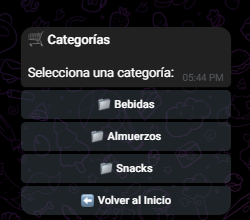

# 🤖 DeliveryBot — Sistema de Pedidos de Cafetería

> Sistema de automatización de pedidos institucionales usando Telegram + n8n + Google Sheets


👉 **[Ver Capturas de Pantalla del Sistema en Acción](#-capturas-de-pantalla)**

---

## 📋 Tabla de Contenidos

- [🎯 Descripción del Problema](#-descripción-del-problema)
- [💡 Solución](#-solución)
- [🏗 Arquitectura del Sistema](#-arquitectura-del-sistema)
- [⚙️ Requisitos Previos](#️-requisitos-previos)
- [🚀 Guía de Despliegue](#-guía-de-despliegue)
- [🔗 Configuración de Webhooks](#-configuración-de-webhooks)
- [🗃 Modelo de Datos](#-modelo-de-datos)
- [🔄 Flujos de Trabajo](#-flujos-de-trabajo)
- [🔒 Seguridad de Datos](#-seguridad-de-datos)
- [🔧 Troubleshooting](#-troubleshooting)
- [🗺 Roadmap](#-roadmap)
- [📄 Licencia](#-licencia)
- [👤 Autor](#-autor)
- [📸 Capturas de Pantalla](#-capturas-de-pantalla)

---

## 🎯 Descripción del Problema

Las cafeterías institucionales —en universidades, corporativos y centros de trabajo— enfrentan problemas operativos recurrentes que afectan tanto a los empleados como al personal de cocina:

| Problema | Impacto |
|----------|---------|
| **Filas largas en hora pico** | Pérdida de 15–25 minutos por persona durante el almuerzo |
| **Errores en pedidos manuales** | 8–12% de pedidos incorrectos por malentendidos verbales |
| **Sin visibilidad de estado** | Los clientes no saben si su pedido está listo o en preparación |
| **Falta de inteligencia de negocio** | Sin datos de ventas, productos populares, o patrones de demanda |
| **Desperdicio de inventario** | Sin alertas de stock bajo, se producen faltantes o sobrestock |
| **Carga administrativa** | El personal pierde tiempo tomando pedidos en lugar de preparándolos |

Estos problemas se magnifican en instituciones con más de 100 empleados, donde los horarios de almuerzo son restringidos y la eficiencia es crítica.

---

## 💡 Solución

**DeliveryBot** es un sistema de automatización de pedidos que transforma la cafetería institucional en una operación digital eficiente, utilizando tecnologías accesibles y de bajo costo:

```
┌─────────────┐     ┌─────────────┐     ┌─────────────┐
│  Telegram    │────▶│    n8n       │────▶│   Google     │
│  (Interfaz)  │◀────│  (Motor)    │◀────│   Sheets     │
│              │     │             │     │   (Datos)    │
└─────────────┘     └─────────────┘     └─────────────┘
   👤 Usuario       ⚙️ Orquestación     📊 Base de datos
```

### Métricas Clave

| Métrica | Valor |
|---------|-------|
| 📦 Pedidos perdidos | **0** — Cada pedido se registra con ID único y tracking |
| ⏱ Reducción de espera | **40%** — Pedidos anticipados desde el escritorio |
| 🔍 Transparencia | **Total** — Estado en tiempo real: RECIBIDO → PREPARACIÓN → LISTO → ENTREGADO |
| 📊 Business Intelligence | **Diaria** — Reportes automáticos de ventas, producto estrella, hora pico |
| 💰 Costo de infraestructura | **~$0** — Usando planes gratuitos de todas las herramientas |

### ¿Por qué esta stack?

- **Telegram**: 700M+ usuarios activos, ya instalado en la mayoría de dispositivos, no requiere descargar otra app
- **n8n**: Automatización visual, self-hosted, gratuito, extensible con JavaScript
- **Google Sheets**: Familiar para todos, editable manualmente como respaldo, historial de versiones automático

---

## 🏗 Arquitectura del Sistema

DeliveryBot utiliza una **arquitectura de 3 capas** diseñada para ser simple, mantenible y escalable dentro de los límites de Google Sheets:

### Capa 1: Interfaz de Usuario (Telegram)

Telegram actúa como el frontend del sistema. Los usuarios interactúan a través de:

- **Menú digital** con botones inline organizados por categorías (Bebidas, Almuerzos, Snacks)
- **Carrito de compras** con resumen visual, cantidades editables y cálculo automático de totales
- **Tracking en tiempo real** del estado del pedido con notificaciones push automáticas
- **Historial de pedidos** consultable en cualquier momento

La interfaz se construye dinámicamente usando `InlineKeyboardMarkup` de Telegram, con callbacks estructurados que codifican la acción y los datos necesarios.

### Capa 2: Motor de Orquestación (n8n)

n8n actúa como el backend del sistema, implementando:

- **FSM Router (Máquina de Estados Finitos)**: Cada usuario tiene un estado que determina cómo se procesa su siguiente mensaje. Los estados incluyen `IDLE`, `MENU_CAT`, `MENU_PROD`, `CARRITO`, `CONFIRMAR`, entre otros.
- **Validador de Stock**: Antes de confirmar un pedido, verifica disponibilidad. Si falla por falta de stock, envía una alerta automática a la cocina y notifica al usuario.
- **Motor de Recomendaciones (Cross-Selling)**: Analiza el historial de pedidos en tiempo real para sugerir automáticamente productos que frecuentemente se compran juntos con los elementos del carrito.
- **Gestión de Logística y Pagos**: Permite selección de método de entrega (sumando costo de envío si aplica) y distintos métodos de pago (Efectivo, Tarjeta, Transferencia).
- **Cálculo Dinámico de ETA**: Calcula el tiempo estimado de entrega basado en la cantidad actual de pedidos activos en cola de preparación.
- **Manejador Global de Errores**: Un flujo dedicado que atrapa fallos imprevistos, evitando bloqueos y ofreciendo una salida elegante al usuario.

### Capa 3: Persistencia de Datos (Google Sheets)

Google Sheets actúa como la base de datos del sistema, con 7 hojas (tabs) que conforman un modelo relacional:

| Hoja | Propósito | Relaciones |
|------|-----------|------------|
| `MENU` | Catálogo de productos | → DETALLE_LINEAS |
| `PEDIDOS` | Registro de pedidos | → USUARIOS, → DETALLE_LINEAS |
| `USUARIOS` | Perfil de usuarios | → PEDIDOS, → SESSIONS |
| `SESSIONS` | Estado FSM por usuario | → USUARIOS |
| `DETALLE_LINEAS` | Líneas individuales de pedido | → PEDIDOS, → MENU |
| `REPORTES_CACHE` | Caché de reportes diarios | — |
| `ERROR_LOG` | Registro de errores | — |

### Componentes

- **Interfaz (Telegram)**: Menú digital, carrito de compras, historial de pedidos, tracking en tiempo real
- **Motor (n8n)**: FSM router, validador de stock, calculadora de precios, motor de notificaciones
- **Datos (Google Sheets)**: MENU, PEDIDOS, USUARIOS, SESSIONS, DETALLE_LINEAS, REPORTES_CACHE, ERROR_LOG

### Flujo de Datos

```
Usuario envía mensaje/callback
        │
        ▼
   [Telegram API]
        │
        ▼
   [n8n Webhook] ──▶ Cargar sesión (SESSIONS)
        │                    │
        ▼                    ▼
   [FSM Router] ◀── Estado actual del usuario
        │
        ├──▶ MENU: Leer MENU sheet → Mostrar categorías/productos
        ├──▶ CARRITO: Leer sesión → Mostrar/editar carrito
        ├──▶ PEDIDO: Validar stock → Escribir PEDIDOS + DETALLE_LINEAS → Notificar cocina
        └──▶ ESTADO: Leer PEDIDOS → Mostrar historial/tracking
        │
        ▼
   Actualizar sesión (SESSIONS) + Responder al usuario (Telegram)
```

> 📖 Para documentación detallada de la arquitectura, ver [`docs/arquitectura.md`](docs/arquitectura.md)

---

## ⚙️ Requisitos Previos

Antes de comenzar, asegúrate de tener:

- [ ] **n8n v1.x** — Self-hosted (Docker recomendado) o n8n Cloud
- [ ] **Cuenta de Google** con API de Google Sheets habilitada
- [ ] **Bot de Telegram** creado via [@BotFather](https://t.me/BotFather)
- [ ] **Node.js 18+** (solo si n8n es self-hosted sin Docker)
- [ ] **Docker y Docker Compose** (recomendado para n8n self-hosted)

---

## 🚀 Guía de Despliegue

### Paso 1: Crear el Bot de Telegram

1. Abrir [@BotFather](https://t.me/BotFather) en Telegram
2. Enviar `/newbot`
3. Asignar un nombre visible: `DeliveryBot Cafetería` (o el nombre deseado)
4. Asignar un username único: `deliverybot_cafe_bot` (debe terminar en `bot`)
5. Copiar el token proporcionado: `123456:ABC-DEF1234ghIkl-zyx57W2v1u123ew11`
6. Configurar los comandos del bot. Enviar a BotFather:

```
/setcommands
```

Y luego enviar la lista de comandos:

```
start - Iniciar o reiniciar el bot
cancelar - Cancelar operación actual
estado - Ver estado de mi pedido
ayuda - Mostrar ayuda
```

7. Configurar descripción del bot con `/setdescription`:
   > "Sistema de pedidos de la cafetería. Envía /start para comenzar."

8. Configurar foto de perfil con `/setuserpic` (subir un logo cuadrado de al menos 512x512px)

### Paso 2: Configurar Google Sheets

> 💡 **Tip:** Puedes [entrar a ver mi Base de Datos aquí](https://docs.google.com/spreadsheets/d/1ENztX5Jw-W8upEOijCgdVbi2_cHfBbOO0Y4O0s6rpuw/edit?usp=sharing) para usarla como referencia.

1. Crear un nuevo Google Spreadsheet llamado **`DeliveryBot_DB`**
2. Crear las siguientes hojas (tabs), renombrando las existentes y agregando nuevas:
   - `MENU`
   - `PEDIDOS`
   - `USUARIOS`
   - `SESSIONS`
   - `DETALLE_LINEAS`
   - `REPORTES_CACHE`
   - `ERROR_LOG`
3. Copiar los headers de cada hoja según la sección [Modelo de Datos](#-modelo-de-datos)
4. Poblar la hoja `MENU` con datos de prueba — ver archivo [`sheets/MENU_sample.csv`](sheets/MENU_sample.csv)
5. En **Google Cloud Console** (https://console.cloud.google.com):
   - Crear un nuevo proyecto (o usar uno existente)
   - Ir a **APIs & Services → Library**
   - Buscar y habilitar **Google Sheets API**
   - Ir a **APIs & Services → Credentials**
   - Crear credenciales tipo **Service Account**
   - Descargar el archivo JSON de credenciales
6. Compartir el spreadsheet con el email de la cuenta de servicio (tiene formato `nombre@proyecto.iam.gserviceaccount.com`) con permiso de **Editor**
7. Copiar el `SPREADSHEET_ID` de la URL del spreadsheet:

```
https://docs.google.com/spreadsheets/d/{SPREADSHEET_ID}/edit
                                        └──── Este valor ────┘
```

### Paso 3: Importar Workflows en n8n

1. Abrir la interfaz de n8n (por defecto en `http://localhost:5678`)
2. Ir a la sección de **Workflows**
3. Para cada archivo JSON en la carpeta `workflows/`:
   - Click en **"Import from file"** (o arrastrar el archivo)
   - Seleccionar el archivo JSON correspondiente
4. Configurar credenciales en cada workflow:
   - **Telegram Bot API**: Ir a Settings → Credentials → Add Credential → Telegram. Ingresar el token del bot.
   - **Google Sheets OAuth2**: Ir a Settings → Credentials → Add Credential → Google Sheets. Subir el JSON de la service account.
5. En cada nodo de Google Sheets dentro de los workflows, reemplazar `YOUR_SPREADSHEET_ID_HERE` con tu `SPREADSHEET_ID` real

### Paso 4: Configurar Variables

En los nodos de configuración (Function nodes marcados como **"Config"** al inicio de cada workflow), actualizar los siguientes valores:

| Variable | Valor de Ejemplo | Descripción |
|----------|-------------------|-------------|
| `ADMIN_CHAT_ID` | `-1001234567890` | ID del grupo/chat de administrador |
| `COCINA_GROUP_ID` | `-1009876543210` | ID del grupo de Telegram de cocina |
| `TAX_RATE` | `0.08` | Tasa de impuesto (8%) |
| `SESSION_TTL_MIN` | `30` | Minutos antes de que expire una sesión inactiva |
| `SPREADSHEET_ID` | `1BxiM...` | ID del Google Spreadsheet |
| `BOT_NAME` | `DeliveryBot` | Nombre mostrado en mensajes |

> 💡 **Tip**: Para obtener el `CHAT_ID` de un grupo de Telegram, agrega el bot [@RawDataBot](https://t.me/RawDataBot) al grupo temporalmente.

### Paso 5: Activar Workflows

Activar los workflows **en este orden** para evitar dependencias rotas:

1. `WF_SESSION_CLEANUP` — Limpieza periódica de sesiones (CRON cada 15 min)
2. `WF_ADMIN_REPORTES` — Generación de reportes diarios (CRON a las 23:55)
3. `WF_ADMIN_PANEL` — Panel de cocina (webhook para callbacks de admin)
4. `WF_MAIN_ROUTER` — **Webhook principal** (activar último, ya que este recibe los mensajes de usuarios)

### Paso 6: Verificar

Realizar las siguientes verificaciones en orden:

- [ ] Enviar `/start` al bot en Telegram → Debe aparecer el menú principal con botones
- [ ] Navegar por las categorías del menú → Los productos deben mostrar nombre, precio y stock
- [ ] Agregar productos al carrito → Debe mostrar resumen con subtotal y total
- [ ] Confirmar un pedido de prueba → Debe generar ID único (ej: `ORD-20260604-0001`)
- [ ] Verificar que el grupo de cocina recibe la notificación del nuevo pedido
- [ ] Desde el grupo de cocina, cambiar el estado del pedido → El usuario debe recibir notificación
- [ ] Verificar que los datos aparecen correctamente en Google Sheets

---

## 🔗 Configuración de Webhooks

### Webhook Automático (Recomendado)

n8n configura automáticamente el webhook de Telegram al activar el workflow `WF_MAIN_ROUTER`. La URL del webhook será:

```
https://tu-instancia-n8n.com/webhook/deliverybot
```

No se requiere configuración adicional si n8n tiene acceso público a Internet.

### Webhook Manual

Si necesitas configurar el webhook manualmente (por ejemplo, tras una migración):

```bash
# Configurar webhook
curl -X POST "https://api.telegram.org/bot{TOKEN}/setWebhook" \
  -d "url=https://tu-n8n.com/webhook/deliverybot" \
  -d "allowed_updates=[\"message\",\"callback_query\"]"

# Verificar webhook
curl "https://api.telegram.org/bot{TOKEN}/getWebhookInfo"

# Eliminar webhook (para debug)
curl "https://api.telegram.org/bot{TOKEN}/deleteWebhook"
```

### Troubleshooting de Webhooks

| Síntoma | Causa Probable | Solución |
|---------|---------------|----------|
| Bot no responde a ningún mensaje | Webhook no configurado o workflow inactivo | Verificar con `getWebhookInfo` y que el workflow esté activo en n8n |
| Error 409 (Conflict) | Otro proceso (polling o webhook anterior) usa el mismo token | Ejecutar `deleteWebhook` y reconfigurar |
| Error de certificado SSL | n8n no tiene HTTPS o el certificado es inválido | Configurar un reverse proxy con SSL (nginx + Let's Encrypt) |
| Timeout en webhook | n8n tarda más de 60s en responder | Optimizar workflows, revisar llamadas a Google Sheets |

**Para desarrollo local**, usar [ngrok](https://ngrok.com) para exponer n8n:

```bash
ngrok http 5678
# Usar la URL HTTPS generada como webhook URL
```

---

## 🗃 Modelo de Datos

### Hoja: `MENU`

Catálogo de productos disponibles en la cafetería.

| Columna | Tipo | Ejemplo | Descripción |
|---------|------|---------|-------------|
| `id_producto` | String | `BEB-001` | ID único. Prefijo indica categoría: BEB, ALM, SNK |
| `nombre` | String | `Café Americano` | Nombre visible al usuario |
| `descripcion` | String | `Café negro 12oz` | Descripción breve del producto |
| `precio` | Number | `3.50` | Precio unitario en USD |
| `categoria` | String | `Bebidas` | Categoría: Bebidas, Almuerzos, Snacks |
| `stock` | Integer | `50` | Unidades disponibles actualmente |
| `stock_minimo` | Integer | `5` | Umbral para alerta de stock bajo |
| `activo` | Boolean | `TRUE` | Si el producto está disponible para ordenar |
| `version` | Integer | `1` | Versión para optimistic locking (incrementa con cada actualización de stock) |

### Hoja: `PEDIDOS`

Registro maestro de todos los pedidos realizados.

| Columna | Tipo | Ejemplo | Descripción |
|---------|------|---------|-------------|
| `id_pedido` | String | `ORD-20260604-0001` | ID único: ORD-{fecha}-{secuencial} |
| `telegram_id` | String | `100000001` | ID de Telegram del usuario que realizó el pedido |
| `detalles_pedido` | JSON String | `[{"id":"BEB-001",...}]` | Array JSON con productos, cantidades y precios |
| `subtotal` | Number | `9.50` | Suma de (precio × cantidad) de cada línea |
| `impuesto` | Number | `0.76` | Subtotal × TAX_RATE |
| `total_pago` | Number | `10.26` | Subtotal + impuesto |
| `estado` | String | `RECIBIDO` | Estado actual: RECIBIDO, PREPARACION, LISTO, ENTREGADO, CANCELADO |
| `fecha` | Date | `2026-06-04` | Fecha del pedido (YYYY-MM-DD) |
| `hora` | Time | `07:30:00` | Hora de creación del pedido (HH:MM:SS) |
| `hora_entrega` | Time | `07:45:00` | Hora de entrega (se llena cuando estado = ENTREGADO) |
| `notas` | String | `Sin mayonesa` | Notas adicionales del usuario (opcional) |
| `tipo_entrega` | String | `Delivery` | Preferencia de entrega: Delivery o Pickup |
| `metodo_pago` | String | `Tarjeta` | Método de pago: Efectivo, Tarjeta o Transferencia |

### Hoja: `USUARIOS`

Perfil y datos de cada usuario registrado.

| Columna | Tipo | Ejemplo | Descripción |
|---------|------|---------|-------------|
| `telegram_id` | String | `100000001` | ID único de Telegram (PK) |
| `nombre_completo` | String | `Andrea López` | Nombre completo del usuario |
| `username` | String | `@andrealopez` | Username de Telegram |
| `departamento` | String | `Ingeniería` | Departamento de la institución |
| `puntos_lealtad` | Integer | `150` | Puntos acumulados del programa de lealtad |
| `fecha_registro` | Date | `2026-01-15` | Fecha de primer uso del bot |
| `activo` | Boolean | `TRUE` | Si el usuario está activo |

### Hoja: `SESSIONS`

Estado de la máquina de estados finitos (FSM) para cada usuario activo.

| Columna | Tipo | Ejemplo | Descripción |
|---------|------|---------|-------------|
| `telegram_id` | String | `100000001` | ID de Telegram del usuario (PK) |
| `estado_fsm` | String | `MENU_CAT` | Estado actual de la FSM |
| `carrito_json` | JSON String | `[{"id":"BEB-001","qty":2}]` | Contenido actual del carrito |
| `contexto_json` | JSON String | `{"cat":"Bebidas"}` | Datos de contexto para el estado actual |
| `ultimo_cambio` | Datetime | `2026-06-04T07:30:00` | Timestamp del último cambio de estado |
| `ttl_expira` | Datetime | `2026-06-04T08:00:00` | Timestamp de expiración (ultimo_cambio + SESSION_TTL_MIN) |

### Hoja: `DETALLE_LINEAS`

Líneas individuales de cada pedido (tabla de detalle normalizada).

| Columna | Tipo | Ejemplo | Descripción |
|---------|------|---------|-------------|
| `id_pedido` | String | `ORD-20260604-0001` | FK al pedido en PEDIDOS |
| `id_producto` | String | `BEB-001` | FK al producto en MENU |
| `nombre` | String | `Café Americano` | Nombre del producto (desnormalizado para reportes) |
| `cantidad` | Integer | `2` | Cantidad ordenada |
| `precio_unitario` | Number | `3.50` | Precio al momento de la compra |
| `fecha` | Date | `2026-06-04` | Fecha del pedido (para facilitar consultas) |

### Hoja: `REPORTES_CACHE`

Caché de reportes diarios generados automáticamente.

| Columna | Tipo | Ejemplo | Descripción |
|---------|------|---------|-------------|
| `fecha` | Date | `2026-06-04` | Fecha del reporte |
| `total_ventas` | Number | `51.84` | Suma total de ventas del día |
| `num_pedidos` | Integer | `5` | Número total de pedidos |
| `producto_estrella` | String | `Café Americano` | Producto más vendido (por cantidad) |
| `cantidad_estrella` | Integer | `3` | Cantidad vendida del producto estrella |
| `hora_pico` | String | `07:00-08:00` | Franja horaria con más pedidos |
| `generado_en` | Datetime | `2026-06-04T23:55:00` | Timestamp de generación del reporte |

### Hoja: `ERROR_LOG`

Registro de errores del sistema para diagnóstico.

| Columna | Tipo | Ejemplo | Descripción |
|---------|------|---------|-------------|
| `timestamp` | Datetime | `2026-06-04T07:32:15` | Momento exacto del error |
| `telegram_id` | String | `100000001` | Usuario afectado (si aplica) |
| `tipo_error` | String | `STOCK_CONFLICT` | Tipo/categoría del error |
| `detalle` | String | `Version mismatch en BEB-001` | Descripción técnica del error |
| `resuelto` | Boolean | `FALSE` | Si el error fue resuelto/manejado |

---

## 🔄 Flujos de Trabajo

### WF_MAIN_ROUTER

**Workflow principal**. Recibe todos los mensajes y callbacks de Telegram a través del webhook. Su función es:

1. Extraer el `telegram_id` del mensaje entrante
2. Cargar (o crear) la sesión del usuario desde la hoja `SESSIONS`
3. Leer el `estado_fsm` actual del usuario
4. Rutear al sub-workflow correspondiente según el estado y el tipo de mensaje
5. Manejar comandos globales (`/start`, `/cancelar`, `/estado`, `/ayuda`) independientemente del estado

```
Mensaje entrante
      │
      ├─ /start ──────────▶ Reset → IDLE → Mostrar menú principal
      ├─ /cancelar ────────▶ Reset → IDLE → Confirmar cancelación
      ├─ /estado ──────────▶ WF_FLOW_ESTADO
      ├─ /ayuda ───────────▶ Mostrar ayuda
      │
      └─ Otro ─────────────▶ FSM Router según estado_fsm
           ├─ IDLE ────────▶ WF_FLOW_MENU (mostrar categorías)
           ├─ MENU_* ──────▶ WF_FLOW_MENU (navegación)
           ├─ CARRITO_* ───▶ WF_FLOW_CARRITO (gestión carrito)
           └─ CONFIRMAR ───▶ WF_FLOW_PEDIDO (procesar pedido)
```

### WF_FLOW_MENU

**Navegación del menú digital**. Gestiona la exploración del catálogo de productos:

- Muestra categorías disponibles como botones inline
- Al seleccionar categoría, muestra productos filtrados con nombre, precio y stock
- Permite seleccionar un producto y elegir cantidad (1-5)
- Agrega el producto al carrito en la sesión
- Valida disponibilidad de stock antes de agregar

### WF_FLOW_CARRITO

**Gestión del carrito de compras**. Permite al usuario revisar y modificar su pedido:

- Muestra resumen del carrito con formato visual (emoji + nombre + qty × precio)
- Calcula subtotal, impuesto y total automáticamente
- Permite eliminar productos individuales del carrito
- Permite vaciar el carrito completamente
- Ofrece opciones: "Seguir comprando", "Confirmar pedido", "Vaciar carrito"

### WF_FLOW_PEDIDO

**Procesamiento del pedido**. Convierte el carrito en un pedido confirmado:

1. Lee el carrito de la sesión
2. **Validación de stock con optimistic locking**: Para cada producto, lee el stock actual y la `version`. Si el stock cambió desde que se agregó al carrito, notifica al usuario y cancela la línea afectada
3. Genera un `id_pedido` único con formato `ORD-{YYYYMMDD}-{secuencial}`
4. Decrementa el stock de cada producto e incrementa la `version`
5. Escribe el pedido en `PEDIDOS` y las líneas en `DETALLE_LINEAS`
6. Limpia el carrito de la sesión y resetea el estado a `IDLE`
7. Envía confirmación al usuario con el desglose del pedido
8. Envía notificación al grupo de cocina con los detalles del nuevo pedido

### WF_FLOW_ESTADO

**Historial y tracking**. Permite al usuario consultar sus pedidos:

- Muestra el pedido activo (si existe) con estado y emoji de progreso
- Lista los últimos 5 pedidos anteriores con resumen
- Para pedidos activos, muestra estado en tiempo real con barra de progreso visual

```
📦 RECIBIDO ──▶ 👨‍🍳 PREPARACIÓN ──▶ ✅ LISTO ──▶ 🎉 ENTREGADO
     ●                 ●                ○              ○
```

### WF_ADMIN_PANEL

**Panel de administración para cocina**. Permite al personal de cocina gestionar pedidos:

- Recibe callbacks de los botones inline en el grupo de cocina
- Valida que el callback proviene del grupo autorizado (`COCINA_GROUP_ID`)
- Permite cambiar el estado del pedido: RECIBIDO → PREPARACIÓN → LISTO → ENTREGADO
- Al cambiar estado, actualiza `PEDIDOS` en Google Sheets
- Envía notificación push al usuario informando el cambio de estado
- Si el estado es ENTREGADO, registra la `hora_entrega`

### WF_ADMIN_REPORTES

**Reportes automáticos diarios**. Se ejecuta vía CRON a las 23:55 cada día:

1. Lee todos los pedidos del día de la hoja `PEDIDOS`
2. Calcula métricas:
   - Total de ventas (suma de `total_pago`)
   - Número de pedidos
   - Producto estrella (más vendido por cantidad)
   - Hora pico (franja horaria con más pedidos)
   - Productos con stock por debajo de `stock_minimo`
3. Guarda el reporte en `REPORTES_CACHE`
4. Envía resumen al grupo de administradores

### WF_ERROR_HANDLER

**Gestión de errores global del sistema**. Configurado en los ajustes ("Settings") de cada flujo principal como su "Error Workflow":

- Atrapa cualquier fallo técnico, caída de API o error de timeout en toda la plataforma.
- Previene que el bot se quede en silencio o "colgado" devolviendo un mensaje elegante: `¡Ups! Tuvimos un problema técnico 🛠️...`.
- Permite que el usuario pueda presionar un botón para regresar al menú principal y reintentar, manteniendo el flujo fluido.

### WF_SESSION_CLEANUP

**Limpieza automática de sesiones**. Se ejecuta vía CRON cada 15 minutos:

1. Lee todas las sesiones de la hoja `SESSIONS`
2. Identifica sesiones donde `ttl_expira` < timestamp actual
3. Para cada sesión expirada:
   - Si tiene carrito con productos, **restaura el stock** de cada producto
   - Elimina la fila de la sesión
4. Registra sesiones limpiadas en el log

> 📖 Para documentación detallada de la máquina de estados, ver [`docs/fsm-estados.md`](docs/fsm-estados.md)

---

## 🔒 Seguridad de Datos

### Autenticación y Autorización

- Cada usuario se identifica por su `telegram_id` único, proporcionado por la API de Telegram y no falsificable
- Los callbacks de administración (cambiar estado de pedidos) se validan contra el `chat_id` del grupo autorizado — solo mensajes originados en el grupo de cocina son aceptados
- Los webhooks de n8n solo aceptan requests de los rangos de IPs oficiales de Telegram (`149.154.160.0/20` y `91.108.4.0/22`)

### Protección contra Inyección

- Todos los inputs del usuario se **sanitizan** antes de escribirlos en Google Sheets
- Se previene la **inyección de fórmulas** prefijando valores de texto con apóstrofe (`'`) cuando comienzan con `=`, `+`, `-`, `@`, `\t`, o `\r`
- Los `callback_data` se validan contra **patrones esperados** usando regex whitelist (ej: `^(cat|prod|qty|cart|confirm)_[A-Z0-9-]+$`)
- Se implementa un **límite de longitud** en todos los campos de entrada de usuario

### Privacidad

- Solo se almacenan datos estrictamente necesarios: nombre, username, departamento, historial de pedidos
- **No se almacena** información financiera sensible (no hay pagos digitales en v1)
- Google Sheets proporciona **encriptación en reposo y en tránsito** (TLS 1.2+)
- El acceso al spreadsheet está restringido a la cuenta de servicio y administradores autorizados
- Cumplimiento con políticas institucionales de protección de datos personales

### Continuidad y Resiliencia

- Google Sheets mantiene **historial de versiones automático** (hasta 100 revisiones)
- Las sesiones tienen **TTL con auto-limpieza** — sesiones abandonadas se eliminan automáticamente
- El sistema incluye **auto-sanación**: cualquier estado FSM inválido o no reconocido se resetea automáticamente a `IDLE`
- Los errores no fatales se registran en `ERROR_LOG` sin interrumpir la experiencia del usuario
- El stock se **restaura automáticamente** cuando un carrito expira sin confirmar

---

## 🔧 Troubleshooting

| Problema | Causa Probable | Solución |
|----------|---------------|----------|
| Bot no responde a ningún mensaje | Webhook desconectado o workflow inactivo | Verificar con `getWebhookInfo`, reactivar workflow `WF_MAIN_ROUTER` |
| "Producto agotado" inesperado | Race condition en stock | Verificar campo `version` en MENU; el optimistic locking debería prevenir esto |
| Sesión del usuario atascada | WF_SESSION_CLEANUP no ejecutándose | Verificar que el workflow CRON está activo y ejecutándose cada 15 min |
| Error 429 de Google Sheets API | Cuota de API excedida (100 req/100s) | Aumentar TTL del caché, reducir frecuencia de CRON, implementar batch reads |
| Stock en números negativos | Bypass del optimistic locking | Verificar la lógica de version check en WF_FLOW_PEDIDO |
| Pedido duplicado | Callback de Telegram procesado dos veces | Verificar deduplicación por `message_id` en WF_MAIN_ROUTER |
| Reporte diario vacío | Sin pedidos con estado ENTREGADO | Verificar que el admin marca pedidos como ENTREGADO desde el panel |
| Bot responde lento (>5s) | Demasiadas lecturas individuales a Sheets | Implementar batch reads y caché en memoria |
| Error "Sheet not found" | Nombre de hoja incorrecto o faltante | Verificar que todas las 7 hojas existen con nombres exactos |
| Usuario no puede agregar al carrito | Sesión expirada silenciosamente | Enviar `/start` para reiniciar; verificar SESSION_TTL_MIN |
| Botones de Cocina ("Preparar") no responden | Conflicto de Webhooks de Telegram | Todo callback de Telegram debe ser recibido por `WF_MAIN_ROUTER` y pasado al sub-flujo (`WF_ADMIN_PANEL`). El sub-flujo NO debe tener su propio `Telegram Trigger`. |
| Error `Could not get parameter` en el Router | Bug en n8n v1.3+ al ocultar parámetros de sub-flujos | Limpiar los datos usando un nodo `Set` explícito antes de invocar un sub-flujo para prevenir la evaluación de variables fantasma del nodo `Execute Workflow`. |
| Error `Could not get parameter` en Google Sheets (Update) | Cambio estructural en n8n v2.23+ para Google Sheets | La nueva versión exige propiedades en el JSON (`matchingColumns`, `schema`, etc). Abre el nodo viejo, realiza un cambio menor y presiona "Save" para regenerar la estructura, o edita el JSON directamente. |

---

## 🗺 Roadmap

- [x] **v0.1**: Estructura de datos y modelo relacional
- [x] **v1.0**: Flujo completo de pedidos (menú → carrito → confirmación)
- [x] **v1.1**: Panel de administración y notificaciones a cocina
- [ ] **v1.2**: Reportes automáticos y métricas de negocio
- [x] **v1.3**: Gestión global de fallos (`WF_ERROR_HANDLER`)
- [x] **v2.0**: Integración de logística (Delivery/Pickup) y pasarela de métodos de pago.
- [x] **v2.1**: Motor inteligente de Cross-Selling (Machine Learning de co-ocurrencia) y ETA dinámico por cola en cocina.
- [ ] **v2.2**: Sistema de favoritos y reordenación rápida.
- [ ] **v2.2**: Sistema de favoritos y reordenación rápida
- [ ] **v3.0**: Migración a base de datos real (Supabase / PostgreSQL)

---

## 📄 Licencia

MIT License — ver archivo [LICENSE](LICENSE) para detalles.

---

## 👤 Autor

**Andrés Guerra** — Desarrollado con ☕ y 🤖 para mejorar la experiencia de cafeterías institucionales.

- GitHub: [@andresguerra321](https://github.com/andresguerra321)
- Email: contacto disponible en el perfil de GitHub

---

<p align="center">
  <strong>¿Preguntas o sugerencias?</strong><br>
  Abre un Issue o contacta al administrador del proyecto.
</p>


## 📸 Capturas de Pantalla

A continuación se muestra el funcionamiento real del sistema DeliveryBot en acción, desde la vista del cliente en Telegram hasta las notificaciones en la cocina y los flujos en n8n:

### Exploración del Menú


### Selección de Productos y Cantidades


### Carrito y Confirmación


### Panel de Administración (Cocina)


### Flujos en n8n


---

## 🕒 Update: Examen Horario

Se ha implementado una restricción en el sistema para evitar que los usuarios envíen pedidos fuera del horario de atención de la cafetería (Lunes a Viernes de 8:00 AM a 5:00 PM).

### Lógica Implementada
Se agregó un nodo **IF (`Check Business Hours`)** en el flujo `WF_FLOW_PEDIDO.json` justo después de que el usuario selecciona "Sí, enviar pedido". 
El nodo evalúa la hora del servidor de n8n mediante la expresión de Luxon:
```javascript
{{ $now.weekday >= 1 && $now.weekday <= 5 && $now.hour >= 8 && $now.hour < 17 }}
```

- **Ruta Verdadera (Dentro de horario):** El flujo continúa normalmente, descuenta el stock y envía la orden a cocina.
- **Ruta Falsa (Fuera de horario):** El flujo se detiene y se activa un nodo Code (`Closed Message`) que retorna el siguiente mensaje al usuario, permitiendo explorar el menú pero no pedir:
> *"🌙 Cafetería Cerrada. Nuestro horario es de Lunes a Viernes, 8am a 5pm. ¡Te esperamos mañana!"*

### Vistas del Mensaje de Cierre

